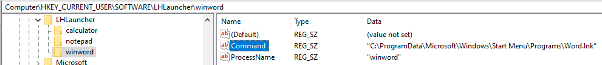

LHLauncher Utility

A system utility for Streamlined Application Launching from Workspace ONE Hub

Introduction
============

Workspace ONE Hub is the go-to platform for centralizing enterprise applications. To expand on its capabilities further, we give you Localhost App Launcher, which allows you to launch local applications like SaaS applications – e.g., From a URL.

Introducing LHLauncher
======================

LHLauncher is a utility designed to streamline the application launching process in a Windows environment. Integrated with Workspace ONE Hub, it offers a secure and efficient way to manage and launch locally installed applications from the hub and App Catalog. The utility enables a centralized approach to managing application settings by reading configurations from the Windows Registry. It also offers SSL/TCP communication capabilities to ensure secure interactions.

Features
========

Dynamic Configuration
---------------------

LHLauncher reads its configuration from the Windows Registry, making it highly flexible and easy to update. We include a sample sensor that you can use to configure these registry entries easily, all in one place.

Process Verification
--------------------

LHLauncher ensures the launched application's process is active, guaranteeing a successful start.

Retries
-------

If the application doesn't start initially, LHLauncher will automatically retry.

Logging
-------

LHLauncher includes a logging feature, making it easier to troubleshoot and maintain. Logs are stored in a pre-configured path or the application's current directory.

How LHLauncher.exe Complements Workspace ONE Hub
================================================

1.  **Simplified Configuration**: LHLauncher integration with the Windows Registry allows IT teams to pre-configure launch commands, further streamlining the user experience.
2.  **Enhanced Reliability**: The process verification and retry mechanisms ensure that applications are reliably launched, adding another layer of robustness.
3.  **Security**: LHLauncher uses a certificate published by you, which you configure for trust, so that all interactions are via SSL using your trusted certificates. It is hardcoded to listen only on 127.0.0.1, preventing anyone from calling it remotely.
4.  **Ease of Deployment**: LHLauncher requires the installer, a certificate to be present on the device it is installing on, and the configuration registry entries. The installer zip file includes a sample PowerShell sensor, which can be deployed to configure the registry on the devices. By default, the application expects a certificate with a subject of localhost.com. The powershell script will also edit the windows hosts file to add that entry.

Usage: A Practical Example with Notepad.exe
===========================================

To provide you with a tangible example, let's consider a common application: Notepad.exe.

**Steps to Configure LHLauncher for Notepad.exe**

LHLauncher looks in the registry for its configuration so there needs to be a registry entry for notepad like this:

This is configured through the PowerShell sensor here.

Then you need to add a Web clip in either Workspace ONE UEM or in
Workspace ONE Access to point to [https://localhost.com/notepad](https://localhost.com/notepad)

That’s how you add an application to your existing LHLauncher configuration.

***Note on Using Start Menu Items***

Sometimes you might not know exactly where the application is installed,
or you might want to launch an application that is installed in the user's profile.
In that case, you can use the Start Menu item to launch the application.

To do this, you need to add a registry entry like this pointing to the Start Menu .lnk file:

This is useful in cases like Microsoft Office where its installed in Program Files for some versions and Program Files (x86) for others.

**Tested application configuration**
I have tested teh following application configurations showing the types of ways you can call the command line:

****Note the placement of the quotes if the application executable or options have spaces in them.****
****The extra quotes are required if there are spaces in the path or options.****

**Sample Log Output**

When you execute these steps, the log file generated by LHLauncher might look something like this:

2023-09-15 07:57:07 \[LHLauncher:423\] Server Listening on 127.0.0.1 on port 443...

2023-09-15 07:57:12 \[LHLauncher:406\] Executing command "C:\\Windows\\System32\\Notepad.exe"...

2023-09-15 07:57:12 \[LHLauncher:406\] Waiting for process notepad to start...

2023-09-15 07:57:12 \[LHLauncher:364\] Process notepad is running

With these steps, you've successfully configured LHLauncher to launch Notepad.exe and verified its process.
You can follow similar procedures to configure LHLauncher for other applications as well.

Steps to deploy LHLauncher
==========================

Dependencies
------------

LHLauncher is a C# Windows application built with .net runtime 6.0.21. This should be installed by Workspace ONE as a dependency application so that LHLauncher can automatically deploy it rather than have the user get prompted to install it when installing.

Here is the link to download it from Microsoft:

[https://dotnet.microsoft.com/en-us/download/dotnet/thank-you/runtime-desktop-6.0.21-windows-x64-installer](https://dotnet.microsoft.com/en-us/download/dotnet/thank-you/runtime-desktop-6.0.21-windows-x64-installer)

Adding it as a dependency

To Find the Application Identifier:

Install the .NET runtime on a Windows Device Manually

### Run PowerShell and then type the command:

Get-WmiObject -Query "SELECT \* FROM Win32\_Product WHERE (Caption LIKE 'Microsoft Windows Desktop Runtime%')"

This will show you the details you need to input:

Copy the IdentifyingNumber and input it as the criteria.

Then click Add.

Finally, Click Save.

Certificates:
=============

Next, you need to deploy your root CA certificate as a device profile.

Then, deploy the Webserver Certificate as a user profile. The Web server certificate should have localhost.com as the subject, and also, please add just localhost as a SAN.

Here is a screenshot showing the web server certificate in the personal store which is verified up to the CA certificate.

The CA certificate is deployed in the Computer - Trusted Root Certification Authorities store.

Configuration Sensor
====================

The Next step is to deploy the configuration Sensor to add the registry entries required to configure LHLauncher:

Add a Windows Sensor:

Give it a name and click next

The Execution context should be Current User

The first section you need to modify is the array of applications you want to configure for the user:

Here, I have configured notepad and calculator:

The next section to configure is the URL to your Workspace ONE Access App Catalog:

The default logging path is C:\\ProgramData\\LHLauncher. You can change that if you like: 

Finally, you can see where the windows hosts file is modified to ensure that localhost.com points to localhost at 127.0.0.1. This is to be compatible with the Workspace ONE Access App Catalog, which requires a fqdn for security.

Deploying LHLauncher.msi
========================

The last step is to deploy the LHLauncher.msi as a standard MSI application. Because it is fully configured, there are just a couple of things you need to add to the standard configuration:

You must add the Windows Desktop Runtime which you configured above as a dependency.

Under Deployment Options, you must set the install context to User.

And in the Images area you can add the image icons of your choice so that the App Catalog has a nice Icon. I have added some samples or you can choose your own.

Click Save and Assign to assign the application to your users.

Final Words

The application is set to launch when installed automatically, and it will start automatically if the user reboots or logs out and logs in. However, because the application is being installed in the system context, it may not run when first installed by the administrator, so please let your users know to either reboot at the end or launch the LHLauncher shortcut once you first deploy it.

If you have questions or requests, please contact Leon Letto at VMware – [lettol@vmware.com](mailto:lettol@vmware.com). I’ll be happy to help however I can.